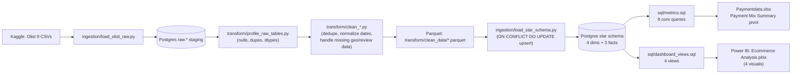
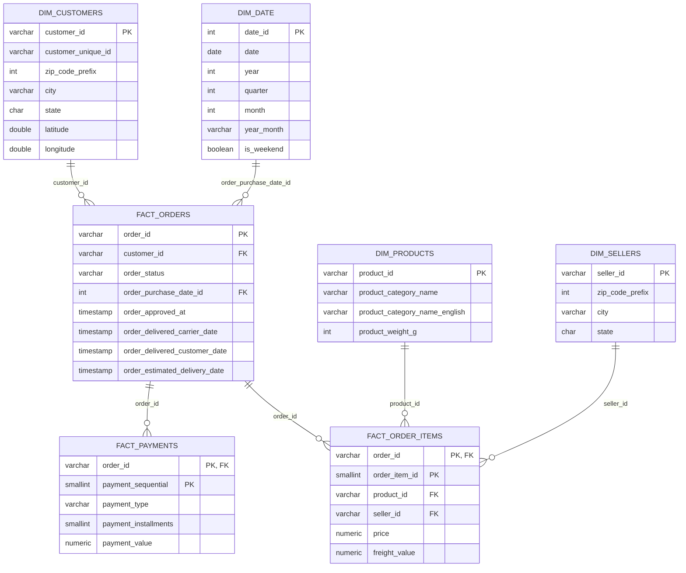

# E-Commerce Sales Analytics Pipeline & Dashboard

An end-to-end analytics pipeline on the [Olist Brazilian E-Commerce dataset](https://www.kaggle.com/datasets/olistbr/brazilian-ecommerce) (~100K orders, 2016–2018): raw ingestion → profiling & cleaning → a Postgres star schema → a SQL analytics layer → a Power BI dashboard and an Excel business summary 

**Skip to:** [Problem](#problem-statement) · [Architecture](#architecture)
· [Data Model](#data-model) · [Analytics Layer](#analytics-layer) ·
[Dashboard](#dashboard) · [How to Run](#how-to-run) · [Interview Quick
Reference](#interview-quick-reference)

---


## Skills This Demonstrates


| Data Analyst / BA lens                                                                                              | Data Engineer lens                                                                                                   |
| ------------------------------------------------------------------------------------------------------------------- | -------------------------------------------------------------------------------------------------------------------- |
| 8 hand-written SQL metrics queries answering real business questions                                                | 9-source ingestion → clean → idempotent load pipeline                                                                |
| Power BI dashboard, scoped to 4 decision-ready visuals (not a wall of charts)                                       | Star schema design (4 dims + 3 facts), deliberately not over-normalized                                              |
| Excel pivot export for a non-technical, stakeholder-facing summary                                                  | `ON CONFLICT DO UPDATE` upsert loader — safe to re-run on refreshed data                                             |
| Data-quality profiling written up *before* cleaning, with reasoning for each decision                               | Raw/clean separation enforced as a pipeline convention, not just a folder name                                       |
| Correctly distinguishing `customer_id` (order-scoped) from `customer_unique_id` (person) before computing retention | Verification script (`verify_metrics.py`) that sanity-checks the pipeline independently of the metrics it's checking |


---


## Problem Statement

Olist's public dataset ships as nine loosely-related CSVs — orders, order
items, products, sellers, customers, payments, reviews, geolocation, and a
category-name translation table. On their own they answer no business
question. This project turns them into a queryable star schema and a
small set of decision-ready metrics: how is revenue trending, which
categories and states drive it, how healthy is the order funnel, how fast
are deliveries, and how many customers come back.

The build deliberately separates concerns the way a production pipeline
would: raw data is never touched by cleaning logic, cleaning is never
mixed with loading, and the load step is idempotent — a design choice
aimed as much at engineering rigor as at getting a dashboard out the
door.

---


## Architecture




Raw data (`raw.*`) is kept byte-for-byte as ingested — no cleaning at
ingestion time. Cleaning happens exclusively in `/transform`, writing
Parquet rather than back into Postgres, so the star-schema loader always
reads from one known-good source. Loading uses a Postgres `ON CONFLICT DO UPDATE` upsert on each table's primary key, making `load_star_schema.py`
safe to re-run against refreshed data without truncating or duplicating.
`sql/dashboard_views.sql` sits directly on the star schema — same table
and column names — so Power BI reads off Postgres with no metric logic
re-implemented in the BI layer.

## Tech Stack

Python (pandas, numpy, SQLAlchemy, psycopg2, requests, pyarrow) ·
PostgreSQL 16 (via Docker) · Power BI Desktop · Excel · Git/GitHub.

## Repo Structure

```
/ingestion   Raw-load scripts, schema DDL application, connection config
/transform   Per-table cleaning scripts + raw-table profiling
/sql         schema.sql, metrics.sql, dashboard_views.sql
/dashboard   Ecommerce Analysis.pbix
/docs        Data quality notes, screenshots, this README
```

---


## Data Model

4 dimensions, 3 facts — deliberately not normalized further (e.g. no
separate geography dimension; state/city/zip live directly on
`dim_customers` and `dim_sellers`). Currency is BRL throughout Olist, so
no FX conversion is in scope anywhere in this pipeline.




**The one design decision worth explaining unprompted:**
`dim_customers.customer_id` is order-scoped — Olist mints a new one per
order. `customer_unique_id` identifies the actual person across orders,
and it's what the repeat-customer-rate query groups on. Grouping on the
wrong key would silently inflate retention/churn numbers — every "repeat"
customer would look like a first-time buyer.

---


## Data Quality

Raw tables were profiled before any cleaning
(`transform/profile_raw_tables.py`, full notes in
`[docs/data_quality_notes.md](docs/data_quality_notes.md)`). All 9 source
files, scale and highlights:


| Source file                             | Raw rows  | Notes                                                                                     |
| --------------------------------------- | --------- | ------------------------------------------------------------------------------------------------- |
| `olist_orders_dataset.csv`              | 99,441    | Core fact source                                                                          |
| `olist_order_items_dataset.csv`         | 112,650   | Line-item grain                                                                           |
| `olist_order_payments_dataset.csv`      | 103,886   | Multiple payment rows per order possible                                                  |
| `olist_order_reviews_dataset.csv`       | 104,719   | 88% / 59% null comment title/message — expected, most reviews are star-rating-only        |
| `olist_customers_dataset.csv`           | 99,441    | One row per order, not per person (see design note above)                                 |
| `olist_products_dataset.csv`            | 32,951    | ~1.85% (≈610 rows) missing category/description metadata                                  |
| `olist_sellers_dataset.csv`             | 3,095     | Clean, no nulls/dupes                                                                     |
| `olist_geolocation_dataset.csv`         | 1,000,163 | **261,831 duplicate rows (26%)** — multiple submissions per zip, not meaningful variation |
| `product_category_name_translation.csv` | 70        | Category name lookup                                                                      |


Key cleaning decisions, and why:

- **Geolocation**: deduped by averaging lat/lng per zip-code prefix rather
than dropping duplicates arbitrarily.
- **Order timestamps**: ~1–3% null delivery/approval timestamps are
expected (canceled/undelivered orders) and deliberately **not**
backfilled — that's exactly the signal the order-status-funnel metric
needs.
- **Products**: rows missing category/description are bucketed as
`'unknown'` rather than dropped, since those products still carry real
revenue in `fact_order_items` — dropping them would silently understate
revenue.

---


## Analytics Layer

Eight queries in `[sql/metrics.sql](sql/metrics.sql)`, each independently
runnable and verified against the live schema by `verify_metrics.py`
(sanity-checks row counts, funnel monotonicity, and plausible-range
checks before calling the phase done).


| #   | Query                                    | Business question it answers                                 | Design note                                                                 |
| --- | ----------------------------------------- | ------------------------------------------------------------ | --------------------------------------------------------------------------- |
| 1   | Monthly revenue trend                    | Is revenue growing, and where are the seasonal spikes?       | Excludes canceled/unavailable orders so revenue reflects fulfilled business |
| 2   | Top 10 categories by revenue             | Which categories should marketing/inventory double down on?  | —                                                                           |
| 3   | Revenue by state                         | Where is the customer base concentrated geographically?      | Grouped on customer's delivery state                                       |
| 4   | Order status funnel                      | How healthy is fulfillment — where do orders drop off?       | Uses the null-timestamp signal instead of backfilling                       |
| 5   | Avg/median delivery time + early-vs-late | Are we hitting delivery promises?                            | Day-granularity precision (see tradeoff below)                              |
| 6   | Repeat customer rate                     | How much of the business comes from repeat buyers?           | Grouped on `customer_unique_id`, **not** `customer_id`                      |
| 7   | Payment mix                              | How do customers pay, and what does that mean for cash flow? | Installments reflect Brazil's installment-purchase culture                  |
| 8   | Freight as % of price by category        | Which categories have shipping eating into margin?           | —                                                                           |


---


## Dashboard

Four visuals in Power BI, built on `sql/dashboard_views.sql` — capped at
four deliberately, since a tight dashboard reads as more competent than a
cluttered one:


- **Monthly Revenue Trend** — steady growth from late 2016 through a
November 2017 spike (Black Friday), then a plateau into mid-2018.
- **Top 10 Product Categories by Revenue** — health & beauty and
watches/gifts lead, each above R$1.2M.
- **Revenue by Brazilian State** — heavily concentrated in São Paulo, the
expected pattern for a São-Paulo-headquartered marketplace.
- **Order Status Funnel** — of orders that reach "approved," the vast
majority make it through shipped → delivered, with cancellations under
1% — a healthy funnel, and one place a stakeholder-facing summary can
point to directly.


## Business-Facing Summary

A pivoted Excel export (`Paymentdata.xlsx`) for a non-technical audience,
sourced from metrics query #7:


| Payment type | Total value (R$)   | Avg. installments | Records      |
| ------------ | ------------------ | ------------------ | ------------ |
| Credit card  | 1,25,42,084.19     | 3.51                | 76,795       |
| Boleto       | 28,69,361.27       | 1.00                | 19,784       |
| Debit card   | 2,17,989.79        | 1.00                | 1,529        |
| Voucher      | 3,79,436.87        | 1.00                | 5,775        |
| Not defined  | 0.00                | 1.00                | 3            |
| **Total**    | **1,60,08,872.12** | **2.85**            | **1,03,886** |


Credit card dominates by both value and volume (76,795 of 103,886
payments), with an average of ~3.5 installments — a reflection of
Brazil's installment-purchase culture that's worth a sentence in any
stakeholder readout, not just a chart.

---


## How to Run

```bash
# 0. Environment
docker compose up -d                 # Postgres on :5433, pgAdmin on :5050
python -m venv venv && source venv/bin/activate
pip install -r requirements.txt
python ingestion/test_connection.py

# 1. Schema + raw ingestion
python ingestion/apply_schema.py
python ingestion/load_olist_raw.py --data-dir ./data/olist

# 2. Profiling + cleaning
python transform/profile_raw_tables.py
python transform/clean_customers.py
python transform/clean_products.py
python transform/clean_sellers.py
python transform/clean_date.py
python transform/clean_orders.py
python transform/clean_order_items.py
python transform/clean_payments.py

# 3. Star schema load (idempotent — safe to re-run)
python ingestion/load_star_schema.py

# 4. Verify metrics, then open Ecommerce Analysis.pbix against the same Postgres instance
python verify_metrics.py
```

---


## What I'd Do With More Time

- **Automate refresh**: wrap ingestion → clean → load in a single Airflow
or Prefect DAG instead of running scripts by hand in sequence.
- **Timestamp-level delivery metrics**: `fact_orders` currently stores
`order_purchase_date_id` (day granularity) rather than the full
purchase timestamp, so delivery-time metrics are accurate to within ~1
day rather than to the hour. Persisting the full timestamp alongside
the date-dim surrogate key would remove that rounding.
<<<<<<< HEAD
- **Live/hybrid ingestion**: Add a secondary live REST API ingestion path
(e.g., a public product or pricing API) alongside the batch CSV loads,
to demonstrate handling both batch and streaming/API-based sources in
the same pipeline.
=======
- **Live/hybrid ingestion**: Add a secondary live REST API ingestion path (e.g., a public product or pricing API) alongside the batch CSV loads, to demonstrate handling both batch and streaming/API-based sources in the same pipeline.l.
>>>>>>> 14d12f4421215dd46cfb3fef5f0bb1425b7851a6
- **Row-level tests**: add dbt or Great Expectations checks (e.g. no
orphaned `fact_order_items`, `fact_payments.payment_value` sums
matching order totals within tolerance) instead of the current single
post-hoc `verify_metrics.py` script.
- **CI**: a GitHub Actions job that spins up Postgres, runs the full
pipeline against a small fixture dataset, and fails the build if
`verify_metrics.py` reports issues.

---


## Interview Quick Reference


### The 30-second pitch

"I built an end-to-end analytics pipeline on Olist's Brazilian e-commerce
dataset — 9 raw CSVs, ~100K orders — that ingests to a raw staging
schema, profiles and cleans it with pandas, loads it into a Postgres star
schema with an idempotent upsert, and surfaces 8 core business metrics
through both a 4-visual Power BI dashboard and an Excel summary for
non-technical stakeholders."

### Numbers to have ready

- **9** source CSVs → **4 dimensions + 3 facts**
- **99,441** orders · **112,650** order line items · **103,886** payments
- **261,831** duplicate geolocation rows found and deduped (26% of that table)
- **~610 products (1.85%)** missing category metadata — bucketed `'unknown'`, not dropped
- **8** SQL metrics queries, **4** dashboard visuals (capped on purpose)
- Credit card = **76,795 / 103,886** payments (~74%), avg **3.51** installments


### Design decisions I'd defend


| If asked...                                                       | Say this                                                                                                                                                                                                      |
| ------------------------------------------------------------------- | ------------------------------------------------------------------------------------------------------------------------------------------------------------------------------------------------------------- |
| "Why raw and clean tables kept separate?"                           | So a bug can always be isolated to ingestion vs. transformation — debugging a joined, half-cleaned table is much harder.                                                                                        |
| "Why `customer_unique_id` and not `customer_id` for repeat-rate?"   | `customer_id` is minted per order; grouping on it would make every repeat customer look new. `customer_unique_id` is the actual person.                                                                        |
| "Why not backfill the null delivery timestamps?"                    | They're not missing data — they're the signal. An order with no `order_delivered_customer_date` is exactly what the funnel needs to count as not-yet-delivered.                                               |
| "Why only 4 dashboard visuals?"                                     | Scope discipline — a tight, decision-ready dashboard communicates better than a cluttered one, and it was a deliberate budget, not a limitation.                                                               |
| "Why is delivery time only accurate to ~1 day?"                     | `fact_orders` stores a `date_id` surrogate key (day grain) rather than the full purchase timestamp, so date-to-date math loses the time-of-day component. Documented as a known tradeoff, not an oversight.    |
| "Is the loader safe to re-run?"                                     | Yes — `load_star_schema.py` uses `ON CONFLICT DO UPDATE` keyed on each table's primary key, so re-running with refreshed data updates rows instead of duplicating or failing.                                  |
| "What would you change with more time?"                             | Airflow/Prefect orchestration, full purchase timestamps, dbt/Great Expectations row-level tests, and CI — see "What I'd Do With More Time" above.                                                              |


### Resume bullets

- *Analyst-leaning:* "Wrote 8 SQL metrics queries and a 4-visual Power BI
dashboard analyzing 99K+ orders, translating raw transactional data
into revenue, funnel, delivery, and retention insights for a
stakeholder-facing summary."
- *Engineer-leaning:* "Designed and loaded a Postgres star schema (4
dims, 3 facts) from 9 raw source files via an idempotent
`ON CONFLICT DO UPDATE` upsert pipeline, with a pre-cleaning data
profiling step and a post-load verification script."
